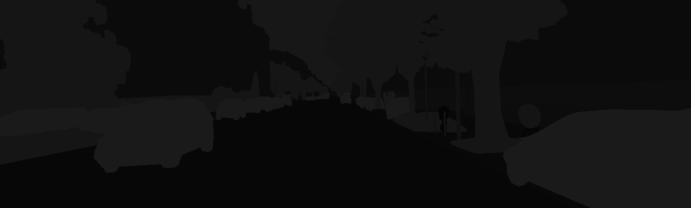
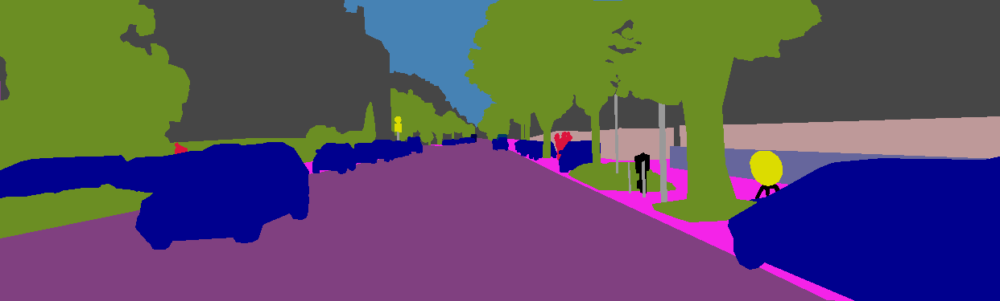
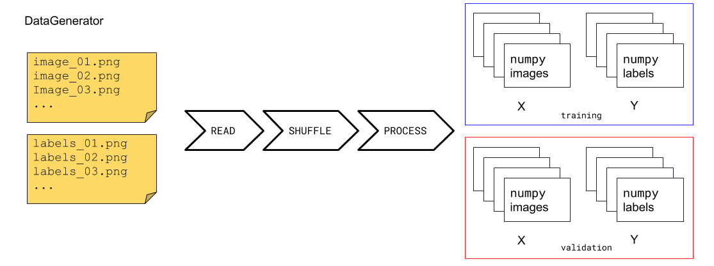
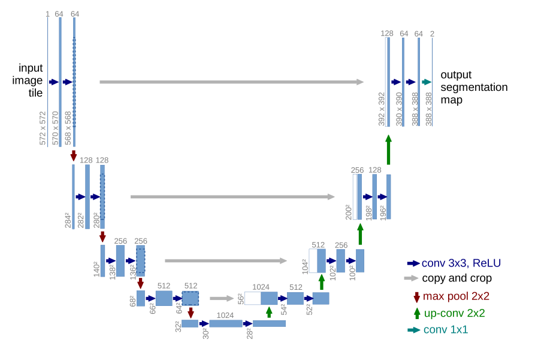

<!--
<ul>
  
    <li>
      <a href="{{ site.baseurl }}{{ post.url }}">{{ post.title }}</a>
      {{ post.excerpt }}
    </li>
  
</ul>
-->

## Introduction

In this project we deal with the problem of semantic segmentation. Our aim is to devise a semantic segmentation architecture in order to leverage multiple data-sets. Before we delve into the description of how the project was carried out, let's provide some context. In the the nest sub-sections we will give an overview of what is semantic segmentation, some of the current result and we provide a motivation for the project.

The model, training and validation steps have been implemented using the [Keras](https://keras.io/) library. Other notable libraries include:

* numpy
* Pillow
* pandas
* matplotlib

## Semantic Segmentation

Semantic Segmentation denotes a class of computer vision problems, whose aim is to divide the region of an image into distinct
sub-areas. What this effectively translates to, is into labeling each individual pixel in the image, where the label carries a specific information.

In the type of information carried by the label lies the difference between two types of semantic segmentation: **pixel-wise** and **instance**.

In **pixel-wise** segmentation each pixel is assigned to a single class. This means that an algorithm will typically output an image of the same size, where each pixel value is the label corresponding to a class. For example 1 could be assigned to the class CAR and and 2 to the class PERSON.

In **instance** segmentation a position in the image will actually carry to pieces of information: The type of the segmented object and a single identifier for that object. This means
that if the image shows two cars, the pixel of the part of images will identify them as CAR 1 and CAR 2. If the algorithm worked well of course.

The following pictures are an example of an camera image, a real semantic segmentation image and a colorized semantic segmentation image.

||||
|:--:|:--:|:--:| 
| *Original Image* | *Semantic* | *Sematic RGB* |

Semantic segmentation can be considered as a step towards the general goal scene understanding. In image classification problems, the objective is to assign a label to an image, which state what is the pictured object. A more complicated problem can be classifying object and returning their bounding boxes. Semantic segmentation can be considered as a step further, where every pixel of the identified object is returned.

It becomes obvious then how this problem is of importance in applications such as autonomous driving or landscape monitoring. Semantic segmentation is also used in medical imaging, where it can be used to isolate brain region, growths or cell nuclei.

## Objective of the project

Producing annotated data-sets for semantic segmentation tasks is not easy. One consequence of that is that annotated data-sets can be quite limited in size. This naturally works against the large data-sets requirement of deep-learning algorithms. For this reason it would be an advantage to be able to leverage a combination of several data-sets. This of course comes with the complication that different data-sets are created with different image sizes and different labelling schemes.

## A necessary introduction: the datasets

After having understood the context of this project, the next necessary step consisted in getting acquainted with the data. For this project we gathered information about X data-sets, which we try to summarize in the following table. This is important because we need implement a way to feed images and from different sources to our model.

| Dataset    | URL                                                                                  | Size                                                                          | Info                                                                                                          |
|------------|--------------------------------------------------------------------------------------|-------------------------------------------------------------------------------|---------------------------------------------------------------------------------------------------------------|
| Cityscapes | [link](https://www.cityscapes-dataset.com/)                                          | 5000 Images: 3475 train/1525 test                                             | Images laid out by type, phase and city. Image names are different across types.                              |
| KITTI      | [link](http://www.cvlibs.net/datasets/kitti/eval_semseg.php?benchmark=semantics2015) | 200 Images in total                                                           |  Simple subdivision camera and semantic                                                                       |
| ADE20K     | [link](http://groups.csail.mit.edu/vision/datasets/ADE20K/)                          | 20.210 train images/2000 test images.                                         | The dataset includes many different types of images, so we must probably select a subset according to content |
| COCO       | [link](http://cocodataset.org/#home)                                                 | Detection(people): 200K images. 80 categories. Stuff(grass, wall) 55K images. | Needs API to extract masks.                                                                                   |

Different data-sets employ different labelling schemes. For simplicity, in this context we decided to work with only the **KITTI** and **Cityscapes** datasets, which use the same labelling scheme. The images provide labels for 33 (34 with 0-label segments) classes, listed in the following table.

| ID | Label                |
|----|----------------------|
| -1 | license plate        |
| 0  | unlabeled            |
| 1  | ego vehicle          |
| 2  | rectification border |
| 3  | out of roi           |
| 4  | static               |
| 5  | dynamic              |
| 6  | ground               |
| 7  | road                 |
| 8  | sidewalk             |
| 9  | parking              |
| 10 | rail track           |
| 11 | building             |
| 12 | wall                 |
| 13 | fence                |
| 14 | guard rail           |
| 15 | bridge               |
| 16 | tunnel               |
| 17 | pole                 |
| 18 | polegroup            |
| 19 | traffic light        |
| 20 | traffic sign         |
| 21 | vegetation           |
| 22 | terrain              |
| 23 | sky                  |
| 24 | person               |
| 25 | rider                |
| 26 | car                  |
| 27 | truck                |
| 28 | bus                  |
| 29 | caravan              |
| 30 | trailer              |
| 31 | train                |
| 32 | motorcycle           |
| 33 | bicycle              |

### Data Generator

We are going to eventually have a model that we train in supervised fashion. That is we provide examples of input and out and the model should hopefully learn to produce accurate descriptions from new input data.

There are two ways in Keras to feed data during training and prediction: through the method `fit` or the method `fit_generator`. In the first method the data is expected to be already in a `numpy` array format, whereas with `fit_generator` one must provide a generator instance. In foresight of the need to combine batches of images from different sources, we opted to write a custom generator.

||
|:--:| 
| *Caption* |

## Model

Our initial approach was to use an implementation of the DeepLab library. DeepLab is a deep architecture that makes use of CRFs and atrous convolution. WHAT ARE CRF and ATROUS. According to [2](#references) it provides the best accuracy on several image data-sets, compare to other architectures. Unfortunately, the model we tried to use did not show any sign of learning. In two epochs the model would reach the best, despite poor, loss value and stop improving on validation loss.

In order to continue we then opted for a much simpler architecture: U-Net. U-Net builds upon the *Fully Convolutional Network(FCN)*. This network was designed by t
It consists of a contracting path (left side) and an expansive path (right side). U-Nat was designed to work well will small data-sets. 

In particular we take inspiration from the code provided [here](https://github.com/zhixuhao/unet/blob/master/model.py). The model is fairly simple and it's easy to verify the correctness by simply following the network's diagram.

||
|:--:|
| U-Net diagram, as presented in the original paper [3](#references) |

## Combining the dataset

At this stage we can create a **U-Net** model and feed training data. In order to use different data-sets we introduced the following modifications:

1. We modified the architecture to have one output per data-set
2. We modified the training process to include a loss function per data-set
3. We modified the data generator to provide sample weights.

Let's see these points one by one.

When trained on a single data-set, the model would have a single output, which consist of a layer for each class of object detected. To leverage multiple data-sets we modify U-Net, so that it will be built with a different head for each data-set. As presented in figure. Each head will have naturally as many layers as needed for the data-set. The idea behind this is that the network will learn different representation at the final layer, but the earlier one should share the same features.

The following snippet shows the little modification in the U-Net code.

```python
def unet(input_size: Tuple[int, int, int], class_layouts: Dict[str, List[int]]) -> Model:
  input_layer = Input(input_size)
  
  # LAYERS

  # LAYERS

  # LAYERS
  
  outputs: List[Conv2D] = []
  for k, v in class_layouts.items():
      num_classes = len(v)
      output_conv = Conv2D(filters=num_classes, kernel_size=1, activation='sigmoid', name=k)(conv9)
      outputs.append(output_conv)

  model = Model(inputs=input_layer, outputs=outputs)

  return model
```

Having multiple heads requires multiple loss function, because the differences to propagate are different. Adding multiple loss function is quite straightforward.

```python
losses: Dict[str, str] = dict()
for ds in datasets:
    losses[ds] = 'categorical_crossentropy'
optimizers: Dict[str, Optimizer] = {'adam': Adam(lr=7e-4, epsilon=1e-8, decay=1e-6),
                                    'sgd': SGD(lr=1e-4)}
optimizer: Optimizer = optimizers[optim]
metrics = ['categorical_accuracy']
model.compile(optimizer=optimizer, loss=losses, metrics=metrics)
```

The trickiest modification involved the data generator. We need a way to map a training instance to the loss function associated to the same data-set, 
so that only that loss is propagated. This can be accomplished using sample weights during training. A sample weight is in general a vector with an element for each loss function. Each element ranges between 0 and 1, and expresses the contribution of the loss function. By using a one-hot encoding sample weight, it is possible to select exclusively one loss function per data-set. The return type of the data-generator has to change to return the input image, a dictionary with a mask for each output and a dictionary with a sample weight for each data-source.

This is probably clear in the following figure.

And here's is how we write the `__get_item__` method of our generator.

```python
targets: Dict[str, np.ndarray] = dict()
  sample_weights: Dict[str, np.ndarray] = dict()
  for idx, ds in enumerate(self.data_sources):
    targets[ds.get_name()] = batch_masks
    if batch_ds.ndim == 1:
        sample_weights[ds.get_name()] = batch_ds
    else:
        sample_weights[ds.get_name()] = batch_ds[:, idx]

return batch_images, targets, sample_weights
```

## Experiments

Our objective was to see whether using a combination of data-set would improve the prediction capabilities. We tried to conduct three different types of training:

* only on the KITTI data-set
* only on the Cityscapes data-set
* on a combination of KITTI and Cityscapes

The parameters that we settled on are the following:

| Parameter               | Value   |
|-------------------------|---------|
| Number of epochs        | 500     |
| Early stopping patience | 10      |
| Batch size              | 16      |
| Image size              | 256x256 |
| Optimizer               | Adam    |
| Learning Rate           | 1e-4    |

Despite several attempts, none of the training runs produced any usable results. The training runs using single dataset showed very slow loss reduction. The runs using the combination of data-sets didn't not produce any error, but gave inconclusive results.

## Conclusions

This section gives us the opportunity to reflect on the work done and to consider where to move from there.

**Things not done well**: We dived into semantic segmentation using a complex model: DeepLab. The unsuccess of this attempt caused a delay, without providing any useful lesson. Beginning with a simpler and more readable model such as U-Net would have allowed to understand better the problem. Another delay was caused by the initial difficulties in training using GPU.

**Things done well**: A-part from the model chosen, the rest of the steps were done in a rational progressive way. The steps to go from data-understanding to model training were nicely sub-tasked. We also added some tests to verify some parts of the implementations and data integrity. The way that data generation utilities were designed should allow to improve and continue working on this problem.

Some of the **next steps** we would take up are:

* Investigate the failure in training in the experiment attempted
* Attempt again to implement DeepLab, which should definitely allow for more accurate predictions
* Use pre-trained weights with DeepLab
* Add support for the other data-sets

## References

1. [DeepLab: Semantic Image Segmentation with Deep Convolutional Nets, Atrous Convolution, and Fully Connected CRFs](https://arxiv.org/abs/1606.00915)
2. [A Review on Deep Learning Techniques Applied to Semantic Segmentation](https://arxiv.org/abs/1704.06857)
3. [U-Net: Convolutional Networks for Biomedical Image Segmentation](https://arxiv.org/abs/1505.04597)

